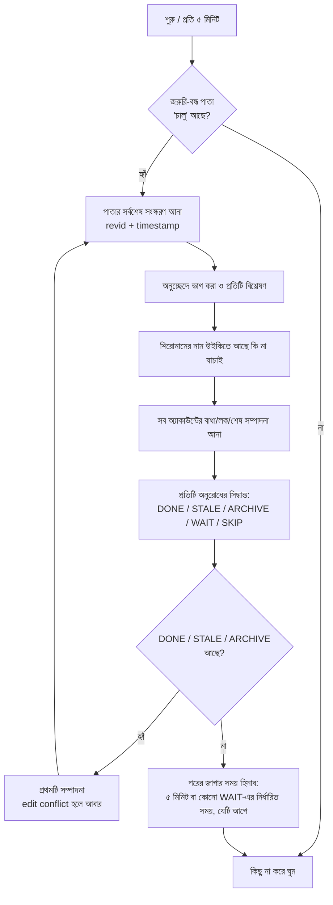

# AdminHelperBot কীভাবে কাজ করে

এই নথিতে বটের প্রতিটি ধাপ, প্রতিটি সিদ্ধান্তের নিয়ম এবং সময়ের হিসাব বিস্তারিতভাবে ব্যাখ্যা করা হয়েছে। উদাহরণগুলো আলোচনাসভার আসল পাতা (সেপ্টেম্বর ২০২৬) থেকে নেওয়া, যা `tests/real_noticeboard.txt`-এ সংরক্ষিত এবং `tests/test_real_page.py`-তে যাচাই করা হয়।

সূচি:

1. [সংক্ষিপ্ত ধারণা](#১-সংক্ষিপ্ত-ধারণা)
2. [প্রতিটি রানের ধাপ](#২-প্রতিটি-রানের-ধাপ)
3. [পাতা পড়া: অনুচ্ছেদ ও রিপোর্টের সময়](#৩-পাতা-পড়া-অনুচ্ছেদ-ও-রিপোর্টের-সময়)
4. [কোন অনুরোধ আগে থেকেই বন্ধ](#৪-কোন-অনুরোধ-আগে-থেকেই-বন্ধ)
5. [রিপোর্ট করা অ্যাকাউন্ট খুঁজে বের করা](#৫-রিপোর্ট-করা-অ্যাকাউন্ট-খুঁজে-বের-করা)
6. [এটি কি বাধাদানের অনুরোধ?](#৬-এটি-কি-বাধাদানের-অনুরোধ)
7. [অ্যাকাউন্টের অবস্থা যাচাই](#৭-অ্যাকাউন্টের-অবস্থা-যাচাই)
8. [সিদ্ধান্তের নিয়ম](#৮-সিদ্ধান্তের-নিয়ম)
9. [সময়ের হিসাব ও সময়সূচি](#৯-সময়ের-হিসাব-ও-সময়সূচি)
10. [পাতায় লেখা ও সম্পাদনা সারাংশ](#১০-পাতায়-লেখা-ও-সম্পাদনা-সারাংশ)
11. [নিরাপদ সম্পাদনা](#১১-নিরাপদ-সম্পাদনা)
12. [চালু হওয়ার সময় স্ব-সমন্বয় (calibration)](#১২-চালু-হওয়ার-সময়-স্ব-সমন্বয়-calibration)
13. [আসল পাতায় বটের আচরণ](#১৩-আসল-পাতায়-বটের-আচরণ)
14. [কোড কাঠামো](#১৪-কোড-কাঠামো)
15. [সীমাবদ্ধতা](#১৫-সীমাবদ্ধতা)

---

## ১. সংক্ষিপ্ত ধারণা

বট তিনটি কাজ করে, শুধু `উইকিপিডিয়া:প্রশাসকদের আলোচনাসভা` পাতায়:

| কাজ | শর্ত | বট যা লেখে |
|---|---|---|
| **সম্পন্ন চিহ্নিত করা** | রিপোর্ট করা *সব* অ্যাকাউন্ট স্থানীয়ভাবে বাধাপ্রাপ্ত / বৈশ্বিকভাবে লক / বৈশ্বিকভাবে বাধাপ্রাপ্ত, এবং শেষ পদক্ষেপের ১০ মিনিট পরেও কেউ চিহ্নিত করেননি | `ADMIN কর্তৃক {{করা হয়েছে}} … --~~~~` ও `{{subst:সহঅ}}` |
| **বাসি অনুরোধ বন্ধ করা** | শুধু অস্থায়ী অ্যাকাউন্ট রিপোর্ট হয়েছে, ৭২ ঘণ্টায় কেউ পদক্ষেপ নেননি, এবং অ্যাকাউন্টটি ৬০ ঘণ্টা ধরে নিষ্ক্রিয় | `বাধা দেওয়ার প্রয়োজন নেই, … টায় হয়েছে। … --~~~~` ও `{{subst:সহঅ}}` |
| **সংগ্রহশালার চিহ্ন যোগ করা** | প্রশাসক `{{করা হয়েছে}}` / `{{করা হয়নি}}` / `{{done}}` দিয়েছেন কিন্তু `{{subst:সহঅ}}` দিতে ভুলে গেছেন; শেষ মন্তব্যের পর ১০ মিনিট কেটে গেছে | শুধু `{{subst:সহঅ}}` |

বাকি সব ক্ষেত্রে বট **কিছুই করে না**। কোনো সন্দেহ থাকলে বট মানুষের সিদ্ধান্তের জন্য অনুরোধটি রেখে দেয়।

## ২. প্রতিটি রানের ধাপ



* প্রতিটি সম্পাদনা **একটি অনুরোধের জন্য একটি**, প্রত্যেকটির নিজস্ব সম্পাদনা সারাংশসহ।
* প্রতিটি সম্পাদনার পর পাতা আবার আনা হয়, যাতে অন্য কারও সাম্প্রতিক পরিবর্তন হারিয়ে না যায়।
* এক রানে সর্বোচ্চ `max_edits_per_run` (২৫) সম্পাদনা।

## ৩. পাতা পড়া: অনুচ্ছেদ ও রিপোর্টের সময়

* প্রতিটি `== শিরোনাম ==` (যেকোনো স্তরের) থেকে পরের শিরোনাম পর্যন্ত একটি অনুরোধ।
* `<!-- -->`, `<nowiki>`, `<pre>` ইত্যাদির ভেতরের শিরোনাম গোনা হয় না।
* একই শিরোনামের একাধিক অনুচ্ছেদ থাকতে পারে (যেমন কয়েকটি "বাধাদানের অনুরোধ")। বট প্রত্যেকটিকে পাতায় তার অবস্থান দিয়ে আলাদা করে, তাই ভুল অনুচ্ছেদে লেখা হয় না।
* **রিপোর্টের সময় = অনুচ্ছেদের প্রথম স্বাক্ষরের সময়** (রিপোর্টকারীর স্বাক্ষর)। বাংলা (`১৪:৪৯, ১৩ জুন ২০২৬ (ইউটিসি)`) ও ইংরেজি (`11:00, 23 September 2026 (UTC)`) দুই রূপই বোঝে; `য়`-এর দুই ধরনের ইউনিকোড রূপ এবং `জানুয়ারি/জানুয়ারী`-জাতীয় বানানভেদও বোঝে।
* স্বাক্ষর না থাকলে অনুচ্ছেদটি বাদ দেওয়া হয়।

## ৪. কোন অনুরোধ আগে থেকেই বন্ধ

চিহ্নগুলো দুই ধরনের (তালিকা [`texts.toml`](../adminhelperbot/texts.toml)-এর `[detection]` অংশে):

| ধরন | উদাহরণ | মানে | বট কী করে |
|---|---|---|---|
| **সংগ্রহশালার চিহ্ন** (`archive_templates`) | `{{সমাধান হওয়া অনুচ্ছেদ}}` (`{{subst:সহঅ}}`-এর ফলাফল), `{{সহঅ}}`, `{{archive top}}` | অনুরোধ সম্পূর্ণ বন্ধ, সংগ্রহশালায় যাওয়ার জন্য প্রস্তুত | **কিছুই না** |
| **সিদ্ধান্তের চিহ্ন** (`decision_templates`) | `{{করা হয়েছে}}`, `{{করা হয়নি}}`, `{{done}}`, `{{not done}}`, `{{resolved}}`, `{{stale}}` … এবং বটের নিজের বাসি-বার্তা | প্রশাসক সিদ্ধান্ত দিয়েছেন, কিন্তু সংগ্রহশালার চিহ্ন হয়তো দেননি | সংগ্রহশালার চিহ্ন না থাকলে শুধু `{{subst:সহঅ}}` যোগ ([নিচে](#সিদ্ধান্ত-হয়েছে-কিন্তু-সংগ্রহশালার-চিহ্ন-নেই)) |

* দুই তালিকাতেই উইকি থেকে শেখা পুনর্নির্দেশগুলোও যোগ হয় (`করা হয়েছে`-এর পুনর্নির্দেশ → সিদ্ধান্ত, `সহঅ`-এর পুনর্নির্দেশ → সংগ্রহশালা)।
* সংগ্রহশালার চিহ্ন মন্তব্যের (`<!-- -->`) ভেতরে থাকলেও গোনা হয় (নিরাপদ দিক)। কিন্তু মন্তব্যের ভেতরের `{{done}}` সিদ্ধান্ত হিসেবে গণ্য **নয়**।
* `{{subst:সহঅ}}` সংরক্ষণের আগে যেমন লেখা থাকে সেটিও সংগ্রহশালার চিহ্ন হিসেবে চেনা হয়।
* `{{Doing}}` কোনো তালিকায় নেই: প্রশাসক কাজ করছেন, শেষ হয়নি।

### সিদ্ধান্ত হয়েছে কিন্তু সংগ্রহশালার চিহ্ন নেই

প্রশাসক `{{করা হয়েছে}}` বা `{{করা হয়নি}}` দিয়েছেন কিন্তু `{{subst:সহঅ}}` দিতে ভুলে গেছেন। এই নিয়ম যেকোনো অনুরোধে প্রযোজ্য, শুধু বাধাদানের অনুরোধে নয়। বট তখন:

* অনুচ্ছেদের **শেষ মন্তব্যের (সর্বশেষ স্বাক্ষরের) ১০ মিনিট পর** (`archive_grace_minutes`) শুধু `{{subst:সহঅ}}` যোগ করে। এই সময়ের মধ্যে প্রশাসক নিজে যোগ করলে বট কিছু করে না। সিদ্ধান্তের পরে কেউ মন্তব্য করলে অপেক্ষা আবার সেই মন্তব্য থেকে গোনা শুরু হয়।
* সিদ্ধান্তের টেমপ্লেটের পরে কোনো স্বাক্ষর না থাকলে (যেমন কেউ স্বাক্ষর ছাড়া `{{done}}` দিলেন) সিদ্ধান্তের সময় জানা যায় না। তখন বট প্রথম যখন এটি দেখেছে, সেই সময় থেকে ১০ মিনিট অপেক্ষা করে (`state.json`-এ সংরক্ষিত)।
* `config.json`-এ `"archive_decided_requests": false` দিলে এই কাজ বন্ধ হয়।

## ৫. রিপোর্ট করা অ্যাকাউন্ট খুঁজে বের করা

শুধু **শিরোনাম** ও **প্রথম মন্তব্য** (রিপোর্টকারীর স্বাক্ষর পর্যন্ত) দেখা হয়। পরের উত্তরগুলোতে থাকা নাম (যেমন `@[[ব্যবহারকারী:…]]` দিয়ে পিং) কখনো রিপোর্ট করা অ্যাকাউন্ট নয়।

যেভাবে নাম পাওয়া যায়:

| উৎস | উদাহরণ (আসল পাতা থেকে) |
|---|---|
| অবদান লিংক | `* [[বিশেষ:অবদান/Swarup Das Official]]` |
| ব্যবহারকারী পাতার লিংক | `[[ব্যবহারকারী:Muriwala Debu\|ব্যবহারকারী:Muriwala Debu]]` |
| শিরোনামের লিংক | `== বাধাদানের অনুরোধ [[বিশেষ:অবদান/~2026-35944-61\|~2026-35944-61]] ==` |
| লেখায় অস্থায়ী অ্যাকাউন্টের নাম | `== বাধাদানের অনুরোধঃ ~2026-32288-48 ==` |
| রিপোর্ট টেমপ্লেট | `{{userlinks\|X}}`, `{{vandal\|X}}`, `{{ব্যবহারকারী\|X}}` … |
| শিরোনামে শুধু লেখা নাম | `== বাধাদানের অনুরোধ: Mr. Souraj ও Mr. Ranju Maity ==` |

**স্বাক্ষর বাদ দেওয়া:** কোনো লাইনে স্বাক্ষরের সময়ের ঠিক আগের শেষ ব্যবহারকারী/আলাপ/অবদান লিংকটি (বা অস্থায়ী অ্যাকাউন্টের নাম) হলো স্বাক্ষরকারী। তাকে রিপোর্ট করা অ্যাকাউন্ট ধরা হয় না। নকশা করা স্বাক্ষর (`[[User:Oindrojalik Watch|<span …>- Wizard Watch</span>]]`), `Special:Contribs` লিংকসহ স্বাক্ষর এবং স্বাক্ষরের আগের XReport লিংক (`[[:m:Special:MyLanguage/User:TenWhile6/XReport|XReport]]`) সবই ঠিকভাবে সামলানো হয়।

**শিরোনামে শুধু লেখা নাম:** `বাধাদানের অনুরোধ: A ও B` / `A, B ও C` ধাঁচের শিরোনাম থেকে নামগুলো নেওয়া হয় (`,`, `ও`, `এবং`, `/`, `&` দিয়ে ভাগ করে)। এগুলো তখনই ব্যবহার হয় যখন উইকি (`list=users`) নিশ্চিত করে যে **প্রতিটি** নামের অ্যাকাউন্ট আছে। একটিও না থাকলে সবগুলো বাদ, কারণ তখন বোঝা যায় শিরোনামটি পরিষ্কার নামের তালিকা নয়।

## ৬. এটি কি বাধাদানের অনুরোধ?

অ্যাকাউন্টের নাম থাকলেই অনুরোধটি বাধাদানের নয়। যেমন আসল পাতার "নিবন্ধ অপসারণ প্রস্তাবনায় অপব্যবহার…" অনুচ্ছেদে `[[ব্যবহারকারী:Sàádî]]` আছে, কিন্তু সেটি বাধাদানের অনুরোধ নয়। তাই বট তখনই কাজ করে যখন:

* শিরোনাম বা প্রথম মন্তব্যের **দৃশ্যমান লেখায়** কোনো মূলশব্দ **শব্দের শুরুতে** থাকে: বাধা, ব্লক, block, লক, lock, ধ্বংসপ্রবণ, ধ্বংসাত্মক, ভ্যান্ডাল, vandal, স্প্যাম, spam, সকপাপেট, sock, অবরুদ্ধ, নিষেধাজ্ঞা, LTA …, **অথবা**
* `{{userlinks}}`-জাতীয় রিপোর্ট টেমপ্লেট ব্যবহার হয়েছে।

"শব্দের শুরুতে" মানে "পুলক" বা "প্রচারণামূলক"-এর ভেতরের "লক" গোনা হয় না, কিন্তু "বাধাদানের" গোনা হয় (শুরুতে "বাধা")। লিংকের গন্তব্য, টেমপ্লেটের প্যারামিটার ও URL দেখা হয় না (যেমন `…Block.pdf`)। আসল পাতায় এই নিয়ম পরীক্ষা করার সময় এই ভুলগুলো ধরা পড়েছিল এবং ঠিক করা হয়েছে।

## ৭. অ্যাকাউন্টের অবস্থা যাচাই

প্রতিটি রিপোর্ট করা অ্যাকাউন্টের জন্য বট API থেকে আনে:

| তথ্য | API | কী পাওয়া যায় |
|---|---|---|
| স্থানীয় বাধা | bnwiki `list=blocks` (`bkusers`, আইপির জন্য `bkip`) | কে বাধা দিয়েছেন (`by`), কখন, আংশিক কি না |
| বৈশ্বিক বাধা | bnwiki `list=globalblocks` (`bgtargets`) | কোন স্টুয়ার্ড, কখন |
| বৈশ্বিক লক | bnwiki `meta=globaluserinfo` + metawiki `list=logevents&letype=globalauth` | লক আছে কি না; কোন স্টুয়ার্ড, কখন |
| শেষ সম্পাদনা | bnwiki `list=usercontribs` (শুধু অস্থায়ী অ্যাকাউন্ট) | সর্বশেষ সম্পাদনার সময় |
| অ্যাকাউন্ট আছে কি না | bnwiki `list=users` (শুধু শিরোনাম-নাম) | missing / invalid |

স্বয়ংক্রিয় বাধা (autoblock) গোনা হয় না। লকের লগ লুকানো থাকলে স্টুয়ার্ডের নাম হিসেবে "স্টুয়ার্ড" লেখা হয়, আর সময় হিসেবে বট প্রথম যখন লকটি দেখেছে সেই সময় (`state.json`-এ সংরক্ষিত) ধরা হয়।

## ৮. সিদ্ধান্তের নিয়ম

প্রতিটি অনুরোধের জন্য `logic.evaluate()` একটি সিদ্ধান্ত দেয়: DONE / STALE / ARCHIVE / WAIT / SKIP। এটি pure function, তাই সহজে পরীক্ষা করা যায়।

```text
সংগ্রহশালার চিহ্ন আছে?                 → SKIP
সিদ্ধান্তের চিহ্ন আছে?
    due = max(শেষ স্বাক্ষর, [স্বাক্ষরহীন হলে] প্রথম দেখার সময়) + ১০ মিনিট
    এখন ≥ due → ARCHIVE (শুধু {{subst:সহঅ}}), নইলে WAIT(due)

রিপোর্টের সময় নেই / অ্যাকাউন্ট নেই    → SKIP
বাধাদানের অনুরোধ নয়                   → SKIP

প্রতিটি অ্যাকাউন্টের জন্য "উত্তর-পদক্ষেপ" = রিপোর্টের ৬০ মিনিট আগে বা পরে
নেওয়া সবচেয়ে প্রথম বাধা/লক/বৈশ্বিক বাধা।

সব অ্যাকাউন্টের উত্তর-পদক্ষেপ আছে:
    due = max(রিপোর্টের সময়, সব পদক্ষেপের সময়) + ১০ মিনিট
    এখন ≥ due → DONE, নইলে WAIT(due)

কোনো অ্যাকাউন্টে কোনো পদক্ষেপই নেই এবং সবগুলো অস্থায়ী অ্যাকাউন্ট:
    due = max(রিপোর্ট + ৭২ ঘণ্টা, শেষ সম্পাদনা + ৬০ ঘণ্টা)
    এখন ≥ due → STALE, নইলে WAIT(due)

বাকি সব (কিছু অ্যাকাউন্টে পদক্ষেপ, রিপোর্টের অনেক আগের বাধা,
নিবন্ধিত অ্যাকাউন্টে পদক্ষেপ নেই)            → SKIP
```

কয়েকটি গুরুত্বপূর্ণ বিষয়:

* **একাধিক অ্যাকাউন্ট:** সবগুলোতে পদক্ষেপ হলে তবেই সম্পন্ন। ১০ মিনিট গোনা হয় *শেষ* পদক্ষেপ থেকে।
* **রিপোর্টের আগে পদক্ষেপ:** রিপোর্ট লেখার সময় প্রশাসক বাধা দিয়ে ফেললে (৬০ মিনিটের মধ্যে) সেটিও উত্তর হিসেবে গোনা হয়; ১০ মিনিট তখন রিপোর্টের সময় থেকে গোনা হয়।
* **অনেক পুরোনো বাধা:** রিপোর্টের ৬০ মিনিটের বেশি আগের বাধা এই অনুরোধের উত্তর নয় (হয়তো রিপোর্টটি বাধা বাড়ানো বা অন্য কিছুর জন্য), তাই SKIP।
* **আংশিক বাধা** ডিফল্টভাবে পদক্ষেপ হিসেবে গণ্য (`count_partial_blocks`)।
* **সবচেয়ে প্রথম পদক্ষেপই** নেওয়া হয়: প্রশাসক প্রথমে বাধা দিলে ও পরে স্টুয়ার্ড লক করলে প্রশাসকের নাম লেখা হয়।
* **বাসি নিয়ম শুধু অস্থায়ী অ্যাকাউন্টের জন্য।** কোনো সম্পাদনাই না থাকলে ৭২ ঘণ্টা পূর্ণ হলেই বাসি।

## ৯. সময়ের হিসাব ও সময়সূচি

* **সার্ভারের ঘড়ি:** প্রতিটি API উত্তরে থাকা `curtimestamp` থেকে বট উইকি সার্ভারের সময় জানে; নিজের কম্পিউটারের ঘড়ি ভুল হলেও হিসাব ঠিক থাকে।
* **সব সময় UTC-তে।** স্বাক্ষর, লগ ও API সব UTC।
* **সঠিক মুহূর্তে জাগা:** বট প্রতি ৫ মিনিটে পাতা দেখে। তবে কোনো অনুরোধের নির্ধারিত সময় (due) পরের ৫-মিনিটের আগে পড়লে বট ঠিক `due + ৫ সেকেন্ড`-এ জাগে। উদাহরণ:

  | সময় | ঘটনা |
  |---|---|
  | ১৩:০০ | চেক; প্রশাসক ১৩:০১-এ বাধা দিলেন → due ১৩:১১ |
  | ১৩:০৫, ১৩:১০ | নিয়মিত চেক, WAIT |
  | **১৩:১১:০৫** | বিশেষভাবে জেগে সম্পন্ন চিহ্নিত করা |

  অর্থাৎ ১০ মিনিটের অপেক্ষা ১০ মিনিটই থাকে, ১০–১৫ মিনিট নয়। (`test_loop_wakes_right_when_due` দেখুন।)
* **সেকেন্ড পর্যন্ত পরীক্ষিত:** ৯ মিনিট ৫৯ সেকেন্ডে কিছু হয় না, ঠিক ১০:০০-এ হয়; একইভাবে ৭২ ঘণ্টা ও ৬০ ঘণ্টার সীমা (`tests/test_logic.py`)।
* স্বাক্ষরের সময় মিনিট পর্যন্ত নির্ভুল (উইকির স্বাক্ষরে সেকেন্ড থাকে না), লগের সময় সেকেন্ড পর্যন্ত।

## ১০. পাতায় লেখা ও সম্পাদনা সারাংশ

অনুচ্ছেদের শেষে (পরের শিরোনামের আগের ফাঁকা লাইন ঠিক রেখে) যোগ হয়:

**সম্পন্ন:**
```
Ferdous কর্তৃক {{করা হয়েছে}} <small>(স্বয়ংক্রিয় বার্তা)</small> --~~~~
{{subst:সহঅ}}
```
একাধিক জন হলে `Steward X ও Yahya কর্তৃক …`, তিনজন হলে `ক, খ ও গ কর্তৃক …`। একই ব্যক্তি একাধিক অ্যাকাউন্টে পদক্ষেপ নিলে নাম একবারই লেখা হয়।

**বাসি:**
```
বাধা দেওয়ার প্রয়োজন নেই, অস্থায়ী অ্যাকাউন্ট থেকে সর্বশেষ সম্পাদনা ২১ জুন ২০২৬, ১১:৫০ (ইউটিসি) টায় হয়েছে। <small>(স্বয়ংক্রিয় বার্তা)</small> --~~~~
{{subst:সহঅ}}
```

**শুধু সংগ্রহশালার চিহ্ন** (সিদ্ধান্ত হয়েছে কিন্তু চিহ্ন নেই):
```
{{subst:সহঅ}}
```

**সম্পাদনা সারাংশ** (উদাহরণ, আসল পাতার পরীক্ষা থেকে হুবহু):

> /\* বাধাদানের অনুরোধ: Swarup Das Official \*/ বট: অনুরোধটি সম্পন্ন হিসেবে চিহ্নিত ও সংগ্রহশালাভুক্তির জন্য প্রস্তুত করা হলো — Swarup Das Official-কে প্রশাসক Ferdous স্থানীয়ভাবে বাধা দিয়েছেন (২৩ সেপ্টেম্বর ২০২৬, ০৫:৫০ (ইউটিসি))। পদক্ষেপ নেওয়ার ১০ মিনিট পরেও কেউ চিহ্নিত না করায় স্বয়ংক্রিয়ভাবে {{করা হয়েছে}} ও {{সহঅ}} যোগ করা হয়েছে। (স্বয়ংক্রিয় সম্পাদনা)

> /\* বাধাদানের অনুরোধ ~2026-35944-61 \*/ বট: অনুরোধটি অপ্রয়োজনীয় হিসেবে চিহ্নিত — রিপোর্ট করার ৭২ ঘণ্টার মধ্যে অস্থায়ী অ্যাকাউন্ট ~2026-35944-61-এর বিরুদ্ধে কোনো প্রশাসক বা স্টুয়ার্ড পদক্ষেপ নেননি এবং গত ৬০ ঘণ্টায় কোনো সম্পাদনা হয়নি (সর্বশেষ সম্পাদনা: ২১ জুন ২০২৬, ১১:৫০ (ইউটিসি)); সংগ্রহশালাভুক্তির জন্য {{সহঅ}} যোগ করা হয়েছে। (স্বয়ংক্রিয় সম্পাদনা)

> /\* পুরোনো অনুরোধ \*/ বট: অনুরোধটি আগেই {{করা হয়নি}} দিয়ে চিহ্নিত করা হয়েছে, কিন্তু সংগ্রহশালাভুক্তির টেমপ্লেট যোগ করা হয়নি; শেষ মন্তব্যের ১০ মিনিট পরেও কেউ যোগ না করায় স্বয়ংক্রিয়ভাবে {{সহঅ}} যোগ করা হলো। (স্বয়ংক্রিয় সম্পাদনা)

এসব লেখা ও সারাংশ [`texts.toml`](../adminhelperbot/texts.toml)-এ বদলানো যায় ([নির্দেশিকা](texts.md))।

সারাংশ ৫০০ অক্ষরের বেশি হলে (অনেক অ্যাকাউন্ট থাকলে) বিস্তারিত অংশ ছোট করা হয়, শুরু ও শেষ অংশ অক্ষত থাকে। বৈশ্বিক পদক্ষেপ হলে সারাংশে "স্টুয়ার্ড … বৈশ্বিকভাবে লক করেছেন / বাধা দিয়েছেন" লেখা হয়।

**স্বয়ংক্রিয় কার্যক্রমের উল্লেখ** তিন জায়গায় থাকে: পাতায় `(স্বয়ংক্রিয় বার্তা)`, সারাংশে "বট:" ও "(স্বয়ংক্রিয় সম্পাদনা)", এবং `bot=1` ফ্ল্যাগ।

## ১১. নিরাপদ সম্পাদনা

* **সম্পাদনা-দ্বন্দ্ব:** `baserevid`, `basetimestamp` ও `starttimestamp` পাঠানো হয়। মাঝখানে কেউ সম্পাদনা করলে MediaWiki `editconflict` দেয়; বট তখন নতুন লেখা এনে পুরো সিদ্ধান্ত আবার নেয় (সর্বোচ্চ ৫ বার)। তাই মাঝখানে কোনো প্রশাসক `{{করা হয়েছে}}` দিলে বট আর লেখে না।
* শুধু লক্ষ্য অনুচ্ছেদের শেষে লেখা যোগ হয়; পাতার অন্য কোনো অক্ষর বদলায় না (পরীক্ষিত)।
* `assert=bot` (বা পরীক্ষার সময় `user`): লগইন হারালে সম্পাদনা ব্যর্থ হয়, বেনামে সম্পাদনা হয় না।
* `nocreate=1`, `maxlag=5`, `watchlist=nochange`।
* নেটওয়ার্ক/৫xx/৪২৯ ত্রুটিতে ক্রমবর্ধমান বিরতিতে পুনরায় চেষ্টা; `maxlag`-এ `Retry-After` মেনে অপেক্ষা।
* কোনো রানে ত্রুটি হলে লগ করে পরের রানে আবার চেষ্টা; বট বন্ধ হয় না।
* **জরুরি বন্ধ:** `run_page` দেওয়া থাকলে সেই পাতায় "চালু" / "true" / "on" না থাকলে বট কোনো সম্পাদনা করে না।

## ১২. চালু হওয়ার সময় স্ব-সমন্বয় (calibration)

উইকিতে টেমপ্লেট বদলালেও যাতে বট ঠিক থাকে, চালু হওয়ার সময় বট:

1. `টেমপ্লেট:করা হয়েছে`-এর সব পুনর্নির্দেশ এনে সিদ্ধান্তের তালিকায়, এবং `টেমপ্লেট:সহঅ`-এর পুনর্নির্দেশ সংগ্রহশালার তালিকায় যোগ করে।
2. API দিয়ে `{{subst:সহঅ}}` কী হয় তা দেখে (`action=parse&pst=1&onlypst=1`)। বর্তমানে এটি হয় `<!--…-->{{সমাধান হওয়া অনুচ্ছেদ|1=—স্বাক্ষর|t=…}}<!--…-->`, তাই `সমাধান হওয়া অনুচ্ছেদ` টেমপ্লেটটি সংগ্রহশালার চিহ্ন হিসেবে শিখে নেয়। (`small`, `u`, `ping`-এর মতো সাধারণ টেমপ্লেট কখনো শেখে না।)

দুটিই লগে দেখা যায়।

## ১৩. আসল পাতায় বটের আচরণ

সেপ্টেম্বর ২০২৬-এর আসল পাতার প্রতিটি অনুচ্ছেদে বট যা বোঝে (`test_every_real_section_is_understood`):

| অনুচ্ছেদ | চিহ্ন | বাধাদানের অনুরোধ? | রিপোর্ট করা অ্যাকাউন্ট | বট কী করবে |
|---|---|---|---|---|
| টেমপ্লেট:Infobox bodybuilder তৈরি | — | না | — | কিছু না |
| টেমপ্লেট:Infobox handball biography | — | না | — | কিছু না |
| বাধাদানের অনুরোধঃ ~2026-32288-48 | **সংগ্রহশালা** (`সমাধান হওয়া অনুচ্ছেদ`) | হ্যাঁ | ~2026-32288-48 | কিছু না |
| পুনরায় ফিরিয়ে দেওয়ার… আবেদন | — | না | — | কিছু না |
| বাধাদানের অনুরোধ: Swarup Das Official | — | হ্যাঁ | Swarup Das Official | বাধা পেলে সম্পন্ন |
| ব্যবস্থা নিন | — | না | — | কিছু না |
| বাধাদানের অনুরোধ ~2026-35944-61 | — | হ্যাঁ | ~2026-35944-61 | বাধা পেলে সম্পন্ন; নইলে ৭২/৬০ ঘণ্টা পর বাসি |
| বাধাদানের অনুরোধ (Muriwala Debu) | — | হ্যাঁ | Muriwala Debu | বাধা/লক পেলে সম্পন্ন |
| বাধাদানের অনুরোধ (আর্মেনীয় নাম) | — | হ্যাঁ | Զեմւկո… (ՀաՒարոդիմ) | বাধা/লক পেলে সম্পন্ন |
| বাধাদানের অনুরোধ: Integrity2020 | — | হ্যাঁ | Integrity2020 | বাধা/লক পেলে সম্পন্ন |
| বাধাদানের অনুরোধ: Mr. Souraj ও Mr. Ranju Maity | — | হ্যাঁ | Mr. Souraj, Mr. Ranju Maity | **দুজনই** বাধা/লক পেলে সম্পন্ন |
| বীর মুক্তিযোদ্ধা… প্রসঙ্গে | — | না | — | কিছু না |
| নিবন্ধ অপসারণ প্রস্তাবনায় অপব্যবহার… | — | **না** | Sàádî | কিছু না (Sàádî বাধা পেলেও) |
| [[Nephrozoa]] পাতাটি পুনর্নির্দেশ… | **সিদ্ধান্ত** (`{{done}}`), সংগ্রহশালার চিহ্ন নেই | না | — | **শুধু `{{subst:সহঅ}}` যোগ** |

## ১৪. কোড কাঠামো

```
adminhelperbot/
├── __main__.py   কমান্ড লাইন: --once, --dry-run, -c অন্য-config.json
├── texts.toml    সব বাংলা লেখা (পাতার লেখা, সারাংশ, টেমপ্লেট, মূলশব্দ)
├── texts.py      texts.toml পড়া ও যাচাই
├── config.py     প্রযুক্তিগত সেটিং পড়া (মান থাকে মূল ফোল্ডারের config.json-এ)
├── api.py        MediaWiki API: লগইন, maxlag, পুনরায় চেষ্টা, সার্ভারের ঘড়ি
├── timeutil.py   বাংলা সংখ্যা, স্বাক্ষরের সময় পড়া, বাংলা তারিখ লেখা
├── parser.py     অনুচ্ছেদ, রিপোর্ট করা অ্যাকাউন্ট, বন্ধের চিহ্ন, মূলশব্দ
├── status.py     বাধা / বৈশ্বিক বাধা / লক / শেষ সম্পাদনা / অ্যাকাউন্ট আছে কি না
├── logic.py      সিদ্ধান্ত (DONE / STALE / ARCHIVE / WAIT / SKIP) — pure function
├── messages.py   পাতার লেখা ও সম্পাদনা সারাংশ
└── bot.py        মূল লুপ, স্ব-সমন্বয়, নিরাপদ সম্পাদনা, সময়সূচি
tests/
├── fakewiki.py              নকল উইকি (API-এর মতো উত্তর দেয়)
├── real_noticeboard.txt     আসল পাতার অনুলিপি
├── test_real_page.py        আসল পাতায় সব পরিস্থিতি
├── test_logic.py            সময়ের সীমা, সেকেন্ড পর্যন্ত
├── test_parser.py           পার্সার
├── test_bot.py              সম্পূর্ণ রান, edit conflict, সময়সূচি, শুধু-সংগ্রহশালা
└── test_texts.py            texts.toml: কাস্টম লেখা, ভুল শনাক্তকরণ, কোডে বাংলা নেই
```

## ১৫. সীমাবদ্ধতা

* শিরোনামে লিংক ছাড়া শুধু নাম থাকলে তা শুধু `বাধাদানের অনুরোধ: …` ধাঁচে বোঝা যায়। অন্যভাবে লেখা নিবন্ধিত ব্যবহারকারীর নাম (লিংক বা টেমপ্লেট ছাড়া) বট ধরতে পারে না, তাই সেই অনুরোধে কিছু করে না।
* একই শিরোনামের একাধিক অনুচ্ছেদ থাকলে সারাংশের `/* … */` লিংক MediaWiki-র নিয়মে প্রথমটিতে যায়। সম্পাদনা নিজে সঠিক অনুচ্ছেদেই হয়, এবং সারাংশে অ্যাকাউন্টের নাম থাকায় কোনটি তা বোঝা যায়।
* অস্থায়ী অ্যাকাউন্টের শেষ সম্পাদনা শুধু বাংলা উইকিপিডিয়ার দৃশ্যমান সম্পাদনা থেকে নেওয়া হয় (মুছে ফেলা সম্পাদনা দেখা যায় না)।
* অনুরোধে উল্লেখ করা আইপি পরিসীমা (range)-এর বাধা শুধু সেই আইপি দিয়ে খোঁজা হয় (`bkip`), যা পরিসীমার বাধাও দেখায়।
